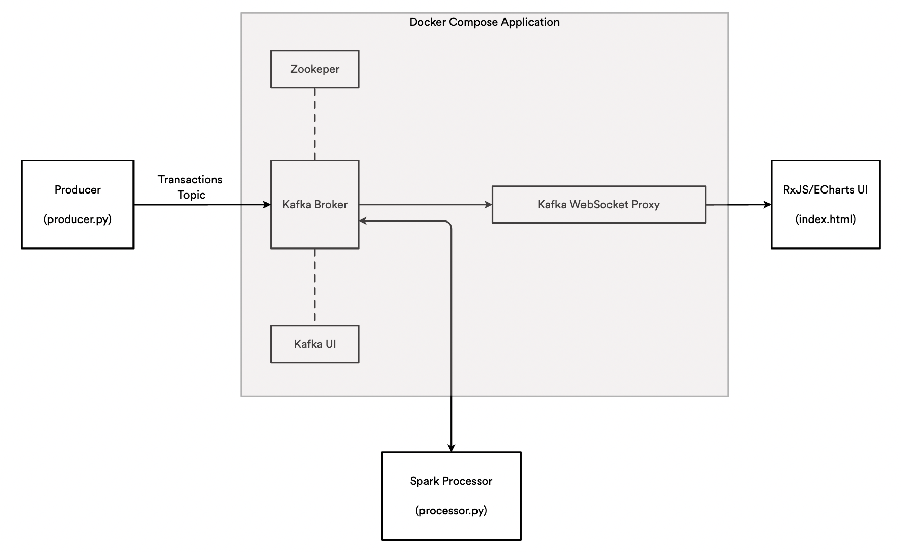

# Real-Time Credit Card Transactions Analysis

<!-- Dashboard removed: streaming-only setup for AI inference -->

## Overview

The purpose of this project is to provide a streaming pipeline of transaction data suitable for AI/ML inference. Data is streamed via Apache Kafka. A Python producer emits transactions from a CSV dataset; a Python consumer (`bin/processor.py`) reads transactions and exposes a hook where you can run your AI model in real time.

The following image depicts the system architecture and all the components:



## Data Sources

Due to privacy-related issues, finding real-time streams of real transactions is hard and the same is true for real transactions performed in the past (sources not in real time). To overcome this lack of data and still be able to develop an application, we will use a transaction dataset generated by a data generator.

Accordingly with the creator of the dataset hosted on Kaggle, the generator used is presented on GitHub in a repository named Sparkov Data Generator and was created for a project called Sparkov, *A Markov-Chain based fraud detection system based in Spark*.

According to the code, in order to generate data, first is necessary to create a customer file and then this file can be used to generate the actual transactions. The generator uses a pre-defined list of merchants and transaction categories. The customer file, containing customer-related data, is generated using a Python library called *Faker*. After the generation of the customers data, it is necessary to select a *profile*, a file that contains some behavioural attributes proper to demographics aspects of the customers. These attributes are defined in terms of minimum and maximum transactions per day, distribution of transactions across days of the week and normal distribution properties (mean, standard deviation) for amounts in various categories. According to the selected profile, the transactions are generated again using *Faker*. An example of profile is named *adults_2550_female_urban.json* and represent behaviours of adult females in the age range of 25-50 who are from urban areas.

As reported by the creator of the dataset, transactions have been generated across all profiles and then merged together to create a more realistic representation of real transactions. The transactions are generated in a time interval that ranges from 1 Jan 2019 to 31 Dec 2020.

The dataset in question is presented in CSV format and can be found on kaggle. This dataset contains more than one million transactions records with related information. The original version of the data contains several attributes, but only a few will be considered for the purpose of the project. In particular, the attributes that will be considered are:

1. ID of the transaction
2. Category of the transaction
3. Amount of the trasaction
4. Gender of the credit card holder
5. City of the credit card holder
6. State of the credit card holder
7. City Population of the city of the credit card holder
8. Job of the credit card holder
9. Unixtime as the timestamp of the transaction

In order to simulate a real-time stream of data we make use of a custom Python file, called `producer.py` that "converts" the tabular data into a stream-like source, sending json messages to a Kafka topic. What this script does is reading line by line the transactions from the dataset, selecting the attributes of interest, parsing this attributes in a json structure and send this json structure to Kafka respecting the timestamp attached to each transaction. In this way we simulate transactions happening in real time and, at the same time, we respect the original time attribute attached to each transaction.

## Technologies and Overall Architecture

1. **Producer**: Python script that converts a CSV file into a real-time stream. Sends JSON to the Kafka topic `transactions`.
2. **Kafka + ZooKeeper**: Core streaming infrastructure managed via Docker Compose.
3. **AI Consumer**: A standalone microservice at `services/ai-consumer` that consumes from `transactions`, invokes your AI model, and can publish predictions to `predictions`.
4. **Docker**: Docker Compose manages Kafka and ZooKeeper; start producer and consumer from the CLI.
5. **Disputes API**: FastAPI service at `services/disputes-api` for dispute submission, chargeback suggestion, and timeline tracking.


## Application Workflow

1. The producer reads the CSV and emits JSON transactions to Kafka topic `transactions`.
2. The AI consumer reads from `transactions` and calls `run_inference(transaction)` for each message.
3. Optionally, the AI consumer publishes inference results to a configured Kafka topic.


## Running the Application

This application was developed and tested is osx-arm64 and it may be necessary to install / remove additional libraries to make the application work on other platforms.

* The first step is to clone this repository and make sure to have all the requisites necessary to use the application. To simplify this operation we can create a new virtual environment and install the required libraries. The `conda_env.txt` file contains all the required libraries in a format that is ready to install in an Anaconda Virtual Environment. Check also that JAVA_HOME points to a Java 8 to 11 JRE/JDK (a custom JAVA_HOME variable can be set inside the conda environment, if necessary)

This operation can be done from the Command Line Interface (CLI) with the following command:
```bash
# navigate to the cloned folder
$ conda create --name kafka-env --file conda_env.txt
$ conda activate kafka-env
```

* The second operation to be performed is to start the Docker composer, which will take care of loading the components needed by the application. Also this operation is done from the CLI, with the following command:

```bash
(kafka-env) $ docker-compose up
```

* Next, we have to launch the producer, which is in charge of transforming the transactions file into a data stream that is sent to Kafka. It is possible to specify how fast the data is forwarded to Kafka with the `speed` attribute: if set to "1" (default) the transactions will be issued respecting the timestamp attached to them, with higher values, the emission speed will increase. Useful option in debugging to see graphs updating very often. Another option that can be applied regards the Kafka server Bootstrap Server setting (default: *localhost:29092*).

Start the producer from the CLI using:
```bash
(kafka-env) $ cd bin/
(kafka-env) $ python producer.py
```

Start the producer at faster speed:
```bash
  (kafka-env) $ cd bin/
  (kafka-env) $ python producer.py --speed 10
```

Start the producer with a specific Bootstrap Server:
```bash
  (kafka-env) $ cd bin/
  (kafka-env) $ python producer.py --bootstrap-servers localhost:29092
```

Start the AI consumer (microservice) with Docker Compose:
```bash
$ docker-compose up --build ai-consumer
```

Or run locally without Docker:
```bash
(kafka-env) $ cd services/ai-consumer
(kafka-env) $ pip install -r requirements.txt
(kafka-env) $ KAFKA_BOOTSTRAP=localhost:29092 INPUT_TOPIC=transactions PREDICTIONS_TOPIC=predictions python consumer.py
```

* No dashboard/UI is included in this streamlined version.

## Disputes API

Start the API:
```bash
$ docker-compose up --build disputes-api
```

Endpoints:
- POST `/disputes` – create a dispute
  - body: `{ "transaction_id": "...", "customer_id": "...", "description": "..." }`
  - returns: dispute with suggested `chargeback_code` and initial timeline
- GET `/disputes/{dispute_id}` – fetch a dispute
- GET `/disputes` – list all disputes
- POST `/disputes/{dispute_id}/status` – append status event to timeline
  - body: `{ "status": "in_review", "note": "assigned to analyst" }`
- POST `/disputes/suggest-code` – suggest a chargeback code from free-text

Data is persisted under the `disputes-data` Docker volume (file `/data/disputes.json`).

## Risk scoring output
The AI consumer publishes to the `predictions` topic messages like:
```json
{ "id": "...", "score": 0.87, "flagged": true, "reasons": ["High amount $1299.00", "Risky category 'electronics'"] }
```

## Kubernetes Deployment

Build images locally (or push to a registry and update image names in manifests):
```bash
# From repo root
docker build -t ai-consumer:latest services/ai-consumer
docker build -t disputes-api:latest services/disputes-api
```

Apply manifests (requires a K8s cluster and Ingress controller if you want ingress):
```bash
kubectl apply -f k8s/zookeeper.yaml
kubectl apply -f k8s/kafka.yaml
kubectl apply -f k8s/ai-consumer.yaml
kubectl apply -f k8s/disputes-api.yaml
```

Verify:
```bash
kubectl get pods
kubectl logs deploy/ai-consumer -f
kubectl port-forward svc/disputes-api 8000:8000
curl http://localhost:8000/disputes
```

Notes:
- The Kafka manifest uses internal listener `kafka:9092`. Producer must point to the same when run in-cluster. For local producer, port-forward or use NodePort/LoadBalancer as needed.
- Ingress in `k8s/disputes-api.yaml` expects an Ingress controller (e.g., NGINX). Remove it if not available and use port-forward instead.

* The application can be stopped by stopping the producer and the processor, and invoking:
```bash
$  docker-compose down -v   # for complete clean up
```


## Integrating Your AI Model

Edit `services/ai-consumer/consumer.py` and implement your logic in `run_inference(transaction: dict) -> Optional[dict]`.
Return a dict to publish to the `PREDICTIONS_TOPIC`, or `None` to skip publishing.

### Jev-based scoring

By default, fraud scoring is rule-based. Setting `TYPESAFE_API_KEY` switches the AI consumer to
[Jev](https://typesafe.ai/blog/introducing-system-one-models-and-jev), a TypeSafe AI "System One" model that
returns typed, calibrated risk decisions instead of free-text LLM output. See `services/ai-consumer/jev_inference.py`.

```bash
(kafka-env) $ cd services/ai-consumer
(kafka-env) $ pip install -r requirements.txt
(kafka-env) $ TYPESAFE_API_KEY=your_api_key KAFKA_BOOTSTRAP=localhost:29092 python consumer.py
```


## REFERENCES & Links
[Apache ECharts](https://echarts.apache.org/en/index.html)

[Apache Kafka](https://kafka.apache.org/)

[Apache Spark](https://spark.apache.org/)

[Spark Streaming](https://spark.apache.org/docs/latest/streaming-programming-guide.html)

[Bootstrap](https://getbootstrap.com/)

[Docker](https://www.docker.com/)

[Kafka Docker Image](https://hub.docker.com/r/confluentinc/cp-kafka)

[Kafka UI Docker Image](https://github.com/provectus/kafka-ui)

[ZooKeeper Docker Image](https://hub.docker.com/r/confluentinc/cp-zookeeper)

[Kafka Websocket Proxy Docker Image](https://kpmeen.gitlab.io/kafka-websocket-proxy/)

[Faker](https://github.com/joke2k/faker)

[Dataset on Kaggle](https://www.kaggle.com/datasets/kartik2112/fraud-detection)

[Sparkov Data Generation](https://github.com/namebrandon/Sparkov_Data_Generation)

[Sparkov Project](https://github.com/namebrandon/Sparkov)

[Reactivex - RxJS](https://rxjs.dev/)
